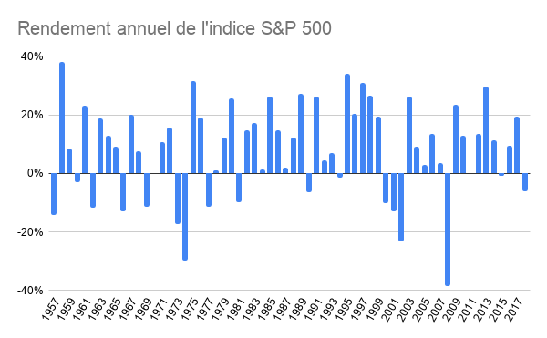

Pour faire fructifier vos économies, vous avez plusieurs options dont investir en action / index, investissement locatif, investissement en crypto-monnaie, investissement en minerai, etc... L'un des plus importants facteurs de comparaison est bien évidemment le rendement annuel.

Pour analyser le rendement historique de l'investissement en action / index, le plus pertinent est d'étudier le S&P 500.
C'est un indice d'une capitalisation colossale de plus de 31 billions, qui suit les 500 plus grandes entreprises américaines. Il existe depuis 1926, mais à l'époque il n'était composé que de 90 entreprises, ce n'est qu'en 1957 qu'il est passé à 500 entreprises.

**Le rendement annuel du S&P 500 sur les dernières 60 années a été de 8%.**

Traduisons cela en terme d'intérêts cumulés. Si quelqu'un avait investi 1,000€ chaque année dans S&P 500 depuis les dernières 60 années, il aurait maintenant 1,253,213€, comparé à simplement 60,000€, s'il n'avait rien investi.

